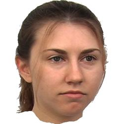
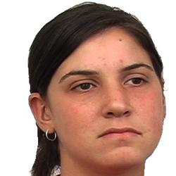
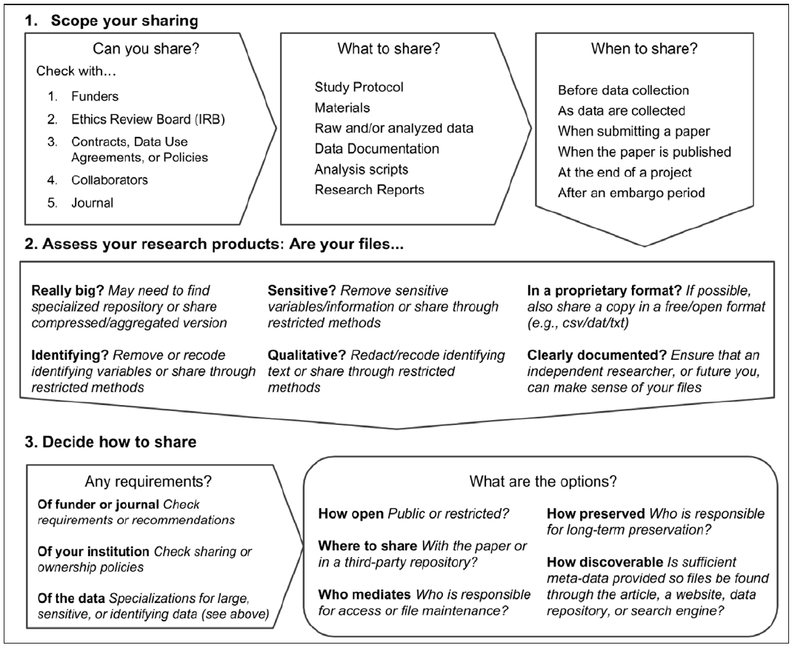
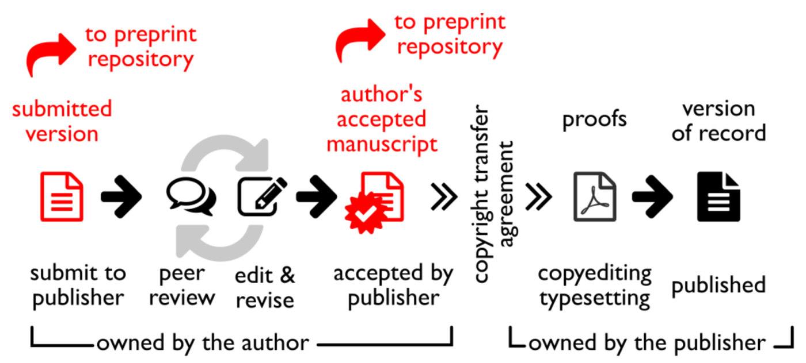
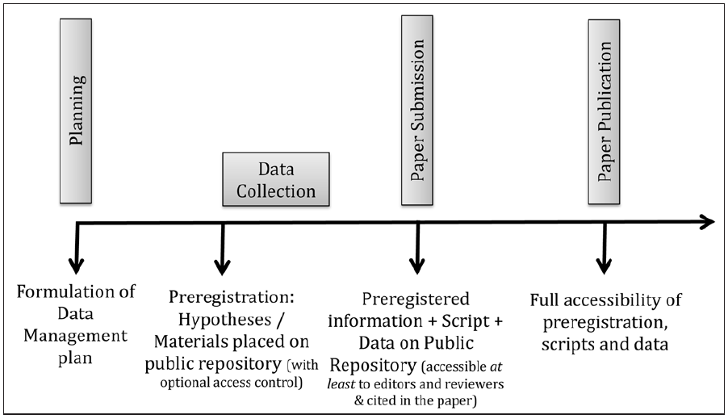
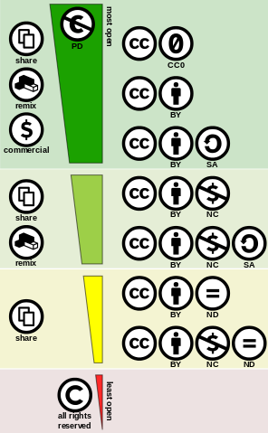

layout: true

```{r setup, include = FALSE}
library("knitr")
library("rmarkdown")

options(htmltools.dir.version = FALSE)

opts_chunk$set(echo = FALSE, fig.align = "center")
```

<div class="my-footer">
  <div style="float: left;"><span>`r gsub("<br />", " & ", gsub("<br /><br />|<a.+$", "", metadata$author))`</span></div>
  <div style="float: right;"><span>`r metadata$location`, `r metadata$date`</span></div>
  <div style="text-align: center;"><span>`r gsub(".+<br />", "", metadata$title)`: `r gsub(".+<br />", " ", metadata$subtitle)`</span></div>
</div>

<script type="text/x-mathjax-config">
MathJax.Hub.Config({
  "HTML-CSS": {
    scale: 150,
  }
});
</script>


---
# About us
## Frederik Aust

- PhD student at the University of Cologne<br />(Prof. Dr. Christoph Stahl)
- Founding memeber of [Cologne Open Science<br />working group](https://www.hf.uni-koeln.de/39711)
- Author and contributor to several R packages<br> (e.g., [`afex`](https://cran.r-project.org/web/packages/afex/index.html), [`citr`](https://cran.r-project.org/web/packages/citr/index.html), [`papaja`](https://github.com/crsh/papaja), [`prereg`](https://cran.r-project.org/web/packages/prereg/index.html))

<div class="reference"><a href="mailto:frederik.aust@uni-koeln.de">frederik.aust@uni-koeln.de</a>, <a href="https://twitter.com/frederikaust">@frederikaust</a></div>


---
# About us
## Johannes Breuer

- PhD in psychology, University of Cologne<br />(media psychology, Prof. Dr. Gary Bente)
- Previously worked at different comm and psych departments
- Now senior researcher at [GESIS &ndash; Leibniz Institute for the Social Sciences](https://www.gesis.org/en/home/) (Data Archive for the Social Sciences)

<div class="reference"><a href="mailto:johannes.breuer@gesis.org">johannes.breuer@gesis.org</a>, <a href="https://twitter.com/MattEagle09">@MattEagle09</a></div>


<!-- Frederik -->

---
# Preliminaries

- Feel free to ask questions at any time
- We want to make this an (inter)active workshop
- Slides and material are available at

.center[`https://tinyurl.com/y8dbs2fu`]

<br /><br />

Workshop material is based on

Klein, O., Hardwicke, T. E., Aust, F., Breuer, J., Danielsson, H., Hofelich Mohr, A., … Frank, M. C. (2018). A Practical Guide for Transparency in Psychological Science. Collabra: Psychology, 4(1). doi: [10.1525/collabra.158](https://doi.org/10.1525/collabra.158)


---
# Workshop outline

- General considerations

--
- What can you share?
    - Study protocol
    - Study materials
    - Data and metadata
    - Standard operating procedures
    - Documentation of analyses
    - Research reports


---
# Workshop outline

- When can you share?
    - Planning a study
    - Before data collection
    - During data collection
    - Upon submission
    - After publication
--
- How can you share?
    - Project file structure
    - Sharing options
    - Choosing a repository
    - Licenses
--
- How you can promote openness?


???
- Try to make it an active workshop
- Questions?


---
class: inverse, middle, center

# `r metadata$title`


---
# `r gsub(".+<br />", " ", metadata$title)`

> .highlight[do not let the perfect be the enemy of the good].
Share and document what you can, as it will provide a benefit compared with not sharing (p. 4, Klein et al., 2018).

&nbsp;

--

> being an open scientist means .highlight[adopting a few straightforward research management practices, which lead to less error-prone, reproducible research workflows] with each incremental step adding positive value (p. 11, Klein et al., 2018).


---
class: inverse, middle, center

# Why share?


---
# Why share?

- You probably already drank the Kool-Aid...
- It's documenting your work
    - Remember what you've done
    - Lab members can learn from each other
    - Colleagues can build on your work

<!-- TODO: Look at paper -->

<!-- - Good for others -->
<!--     - Good for you -->
<!--         - In-lab transparency -->
<!--         - Paul Wilson quote -->

<!-- How to introduce new workflow in lab? -->

> … until recently I was an open-data hypocrite. Although I was committed to open data, I was not implementing it in practice. … Some of it was a lack of effort. It was a pain to document the data; it was a pain to format the data; it was a pain to contact the library personnel; it was a pain to figure out which data were indeed published as part of which experiments. Some of it was forgetfulness. I had neither a routine nor any daily incentive to archive data (p. 1063, [Rouder, 2016](https://doi.org/10.3758/s13428-015-0630-z))

- Make transparency a default
    - Fear of being scooped
        - Usually an unwarranted fear
        - Publish upon acceptance or with an embargo
    - Fear of being corrected
        - Errors are inevitable and a normal part of science
        - Promotes scientific self-correction
        - Constructive self-correction can improve a researcher's standing ([Fetterman & Sassenberg, 2015](https://doi.org/10.1371/journal.pone.0143723))
    - Personal data
        - Get informed consent
        - Pseudonymize data
        - Employ access controls
    - Time-consuming
        - Take one step at a time ("baby steps")
            - Iteratively improve your workflow
        - Increases efficiency in the long-run
        - Increases exposure and citations
        <!-- - Helps to avoid fruitless avenues for future studies -->
        <!-- - Use (or create) templates & available tools -->
- Make transparency a by-product of your workflow
    - If possible, share all products of the research process (as early as possible)
    - If negative constraints prohibit transparency, explicitly declare and justify these decisions
- _Amnesia test_ (Would I still understand this after losing my memory?)
        <!-- - Ask a colleague who was not involved with the project -->
- Iteratively improve your workflow
    - Create and use templates
    - Automate what can be automated

> do not let the perfect be the enemy of the good. Share
and document what you can, as it will provide a benefit
compared with not sharing (p. 4, [Klein et al., 2018](http://doi.org/10.1525/collabra.158)).

<!-- - Reduces extra sharing efforts -->

<!-- - Making your workflow play well with the rest of the lab? -->
<!--     - Do not impose -->
<!--     - Compromise surely necessary -->


---
# Example project

### Research question

Can we accurately judge a person's IQ by looking at their face?

### Study design

- Photographs of students with known IQ scores
- Ratings of IQ
- Likert-scale ratings of attractiveness

```{r example-elements}
# example_citation <- '<div class="reference">Kleisner, K., Chvátalová, V., & Flegr, J. (2014). Perceived Intelligence Is Associated with Measured Intelligence in Men but Not Women. <i>PLoS ONE</i>, 9(3): e81237. doi: <a href="https://doi.org/10.1371/journal.pone.0081237">10.1371/journal.pone.0081237</a></div>'
example_citation <- '<div class="reference">Stimulus images courtesy of Michael J. Tarr, Center for the Neural Basis of Cognition and Department of Psychology, Carnegie Mellon University, http://www.tarrlab.org/. Funding provided by NSF award 0339122. <a href = "https://creativecommons.org/licenses/by-nc-sa/3.0/">CC-BY-NC-SA 3.0</a></div>'

# example_likert_scale <- '<table id="likert">
#    <tr>
#        <td><input id="radGuiltyStart" type="radio" name="Guilty" value="7" /></td>
#        <td><input type="radio" name="Guilty" value="6" /></td>
#        <td><input type="radio" name="Guilty" value="5" /></td>
#        <td><input type="radio" name="Guilty" value="4" /></td>
#        <td><input type="radio" name="Guilty" value="3" /></td>
#        <td><input type="radio" name="Guilty" value="2" /></td>
#        <td><input id="radGuiltyEnd" type="radio" name="Guilty" value="1" /></td>
#    </tr>
#    <tr>
#        <td style = "background-color: white;"><small>Low</small></td>
#        <td style = "background-color: white;"></td>
#        <td style = "background-color: white;"></td>
#        <td style = "background-color: white;"><small>Intelligence</small></td>
#        <td style = "background-color: white;"></td>
#        <td style = "background-color: white;"></td>
#        <td style = "background-color: white;"><small>High</small></td>
#    </tr>
# </table>'

example_likert_scale <- '<center>
    <fieldset style = "width: 600px;">
        <legend style = "padding: 6px;">What is this person\'s IQ?</legend>
    
        70 <input type="range" id="start" name="volume" min="70" max="130" step = "1" style = "width: 500px;"/> 130
    </fieldset>
    <br />
    <fieldset style = "width: 600px;">
        <legend style = "padding: 6px;">How attractive is this person?</legend>
    
        <table style = "width: 600px; border: none;">
           <tr>
               <td><small>Very unattractive</small></td>
               <td><input type="radio" name="Guilty" value="6" /></td>
               <td><input type="radio" name="Guilty" value="6" /></td>
               <td><input type="radio" name="Guilty" value="5" /></td>
               <td><input type="radio" name="Guilty" value="4" /></td>
               <td><input type="radio" name="Guilty" value="3" /></td>
               <td><input type="radio" name="Guilty" value="2" /></td>
               <td><input id="radGuiltyEnd" type="radio" name="Guilty" value="1" /></td>
               <td style = "text-align: right;"><small>Very attractive</small></td>
           </tr>
        </table>
    </fieldset>
</center>'
```


---
# Example project

.center[]

`r example_likert_scale`


---
# Example project

.center[]

`r example_likert_scale`


---
# Example project

.center[]

`r example_likert_scale`


---
# Example project

.center[]

`r example_likert_scale`


---

<div style="font-size: 14px;">

```{r exmaple-dataset}
DT::datatable(
  read.csv("material/example-project/raw_data/perceived_iq_01.csv")
  , rownames = FALSE
  , caption = "Raw data of participant 01"
  , width = "700px"
  , height = "500px"
  , class = "compact hover order-column nowrap"
  , options = list(pageLength = 20)
)
```

</div>


---
# What can you share?

```{r figure1, fig.cap = "Decision flowchart outlining important considerations when sharing research products (reprinted from [Klein et al., 2018](http://doi.org/10.1525/collabra.158), [CC-BY Attribution 4.0](https://creativecommons.org/licenses/by/4.0/))."}

```


## Study protocol

- "Recipe for replication"
- Collates, describes, and organizes more specific research products
    - Hypotheses
    - Study materials
    - Detailed description of procedure
        - Instructive video documentation (e.g., [OBS](https://obsproject.com/) for computer-based studies) `r recommendation`

        <!-- - __Demonstration:__ OBS https://osf.io/eyfxs/ -->
    
<!-- - May be more detailed than published description -->
<!-- - Facilitates scientific progress (e.g., replication and extension) -->


## Study materials

- Anything necessary to conduct the study, e.g.,
    - Questionnaires
    - Stimulus material
    - Computer code to present stimuli and collect responses
    - Instructions for interaction with participants
    - potentially also scripts/instructions for confederates

- Mind intellectual property rights!

    <!-- TODO: Anything else? -->
    
<!-- - Aids interpretation of results -->
<!-- - Facilitates scientific progress (e.g., replication and extension) -->

<!-- Johannes -->

## Data

- Include information about data sharing in informed consent (see [informed consent templates](http://psych-transparency-guide.uni-koeln.de//informed-consent.html) by Klein et al., 2018)
- Use open and interoperable file formats (e.g., CSV, TSV, JSON, ODS)
    - Use UTF-8 character encoding

<!-- https://twitter.com/dutchscientist/status/898938100008845313 -->

- Raw data
    - As originally recorded (e.g., paper-pencil-questionnaires, CSV files, video recordings)

- Processed data
    - As used for analyses (e.g., coded, digitized, merged)
    - Ideally "Tidy Data" ([Wickham, 2014 ](https://www.jstatsoft.org/index.php/jss/article/view/v059i10/v59i10.pdf)) `r recommendation`
        1. Each measured variable in one column.
        2. Different observation of the variables in a different rows
        3. Multiple tables should include a column that allows them to be linked
    
    <!-- https://www.tandfonline.com/doi/abs/10.1080/00031305.2017.1375987 -->

- Participant privacy
    - [EU GDPR](http://www.eugdpr.org/): Data are personal if attributable to a specific person (using additional datasets if necessary)
        - [IAPP: How GDPR changes the rules for research](https://iapp.org/news/a/how-gdpr-changes-the-rules-for-research/)
        - Australian National Data Service: [Decision tree for sharing sensitive data](https://www.ands.org.au/__data/assets/pdf_file/0010/385309/sensitive-decision-tree.pdf)
    - Only collect the data you really need
    - Delete identifying information used for logistics as soon as possible (e.g., e-mail addresses)
    - Only share anonymized data publicly, e.g.,
        - Delete directly identifying information (e.g., full name, address, face, handwriting, date of birth, genetic information)
            - Mind combinations of indirect identifiers (e.g., ZIP code, gender, and date of birth, [Sweeney, 2000](https://dataprivacylab.org/projects/identifiability/paper1.pdf))
        - Separate demographics used for sample description and study data
        - Remove free text entries and potentially also alter them when citing in publications
        - If necessary, transform data, e.g.,
            - Binning
            - Top and bottom coding
            - Add noise
            - Aggregation
        - Use anonymization tools (e.g., [ARX](http://arx.deidentifier.org/), [Amnesia](https://amnesia.openaire.eu/index.html))
    - Control access to pseudonymized data
    
    <!-- - Harm assessment? -->
    
    - Assess risk of reidentification, e.g.,
        - Small population and rare traits
        - Dyadic data
        - Hierarchical data (e.g., small subsamples of students, co-workers)
        - Self-identification??? <!-- TODO: How is this a problem/How would it be possible to prevent this? -->
        - _Motivated intruder test_ (e.g., jealous partner, nosy neighbor, envious co-worker, insurers, criminals)
    <!-- - Who will the data be shared with? -->

> To determine whether a natural person is identifiable, account should be taken of all the means reasonably likely to be used, such as singling out, either by the controller or by another person to identify the natural person directly or indirectly.
<br /><br />
To ascertain whether means are reasonably likely to be used to identify the natural person, account should be taken of all objective factors, such as the costs of and the amount of time required for identification, taking into consideration the available technology at the time of the processing and technological developments. (Recital 26 EU GDPR)


## Metadata

- Sampling procedure (who collected the data how, when, and where)
- Dataset, e.g.,
    - Number of observations
    - Name and description of variables (incl. source of a measure, information about translation)
    - Units of measurement, coding of values (e.g., "1 = Female","2 = Male"), possible options or range in which the data points can fall (e.g., “1 = not at all to 7 = Very much”)
    - Value(s) used for missing data
    - If necessary, how a variable was derived from other variables (e.g., "`bmi` was derived from body weight `m` and height `l` as $\mathrm{BMI} = \frac{m}{l^2}$.")
- Automate codebook generation
    - Analysis software (e.g., [R `codebook` package](https://cran.r-project.org/web/packages/codebook/index.html), [SPSS codebook function](https://libguides.library.kent.edu/SPSS/Codebooks), or [Stata codebook function](http://www.stata.com/manuals13/dcodebook.pdf))
    - Specialized software (e.g., [Nesstar](http://www.nesstar.com/software/publisher.html), [DataWiz](https://datawiz.leibniz-psychology.org/DataWiz/?datawiz_locale=en))
- For data with high reuse value, consider using a standardized and machine-readable format (e.g., [DDI](https://www.ddialliance.org/))
    - Implementation is a service provided by some repositories
    <!-- This documentation should describe the variables in each data file in both human- and machine-readable formats (e.g., csv, rather than docx or pdf).Ideally, codebooks are organized in such a way that each line represents one variable and each information relative to a variable represents a column. -->
- Can almost always be shared, even if raw or processed data cannot


## Standard operating procedures

- Define default practices ([Lin & Green, 2016](
https://doi.org/10.1017/S1049096516000810))
- Study planning, e.g.,
    - Sample size determination
- Data analysis, e.g.,
    - Statistical models
        - Assumption tests
        - Follow-up tests
    - Exclusion criteria
    - Outlier and dropout treatment
    - Handling of missing values
    - Use of covariates
    - Corrections for multiple comparisons
- Example: [SOP for Green lab at Columbia](http://alexandercoppock.com/Green-Lab-SOP/Green_Lab_SOP.pdf)

<!-- - Simplifies authoring of preregistrations -->

<!-- https://doi.org/10.1017/S1049096516000810) -->

<!-- - **Demonstration**: Show examples (https://osf.io/rv7py/, https://osf.io/e4tqy/), show `codebook` package and [SPSS codebook function](https://libguides.library.kent.edu/SPSS/Codebooks) -->
<!-- The author of the codebook (Arslan, 2018) package for R has also created a web app for creating codebooks for SPSS, Stata or RDS files: https://rubenarslan.ocpu.io/codebook/www/ -->


## Documentation of analyses

- Exact specification of how to move from raw data to reported results (incl. data cleaning and transformation; see [supplementary material](http://psych-transparency-guide.uni-koeln.de/analytic-reproducibility.html#set-and-record-seeds-for-pseudorandom-number-generators) of Klein et al., 2018)
    - Step-by-step documentation for non-scriptable software programs
    - Analysis syntax
        - Avoid "works on my machine" errors (WOMME)
            - Relative file paths or permanent online sources
            - Avoid spaces and special characters
            - Test on another computer
        - Write reports as dynamic documents (e.g., R package [`papaja`](https://github.com/crsh/papaja)) `r recommendation`
    - Set and record seeds for pseudo-random number generators
- Documentation of computational environment 
    - Hardware
    - Software version incl. extensions
    - Cloud-based platforms (e.g., [Code Ocean](https://codeocean.com/), [RStudio cloud](https://rstudio.cloud/), [Colaboratory](https://colab.research.google.com/))
    - Containers and virtual machines (e.g., [Docker](https://www.docker.com/), [Vagrant](https://www.vagrantup.com/), [Singularity](https://www.sylabs.io/singularity/))
- Share intermediate results for complex analyses


## Research reports

- Paywalled publications (green open access, see Figure\ \@ref(fig:pre-post-print))
    - Preprint (initially submitted manuscript)
    - Postprint (accepted manuscript) `r recommendation`
    - Mind journal policy (e.g., [SHERPA/RoMEO](http://www.sherpa.ac.uk/romeo/search.php), [Wikipedia list of journals by preprint policy](https://en.wikipedia.org/wiki/List_of_academic_journals_by_preprint_policy))
- Gold open access
    - Published article


```{r pre-post-print, fig.cap = "The typical editorial cycle of academic journals, preprints, and postprints (reprinted from [Marwick et al., 2017](http://www.saa.org/Portals/0/SAA_Record_Sept_2017_Final_LR.pdf#page=10), [CC-BY Attribution 4.0 International](https://creativecommons.org/licenses/by/4.0/))."}

```


<!-- Johannes -->

---
# When can you share

> any time is better than never  (p. 4, [Klein et al., 2018](http://doi.org/10.1525/collabra.158)).

```{r figure2, fig.cap = "Typical workflow indicating when to share research products at different stages of the research process (reprinted from [Klein et al., 2018](http://doi.org/10.1525/collabra.158), [CC-BY Attribution 4.0](https://creativecommons.org/licenses/by/4.0/))."}

```

## Planning a study

- Have a _basic_ data management plan (DMP), ideally before starting a project
    - Create basic reusable DMP templates
        - [ICPSR Framework for Creating a Data Management Plan](https://www.icpsr.umich.edu/icpsrweb/content/datamanagement/dmp/framework.html)
        - [DDC: How to Develop a Data Management and Sharing Plan](http://www.dcc.ac.uk/resources/how-guides/develop-data-plan)
    - Use online tools to get started (e.g., [ZPID DataWiz](https://datawiz.leibniz-psychology.org/DataWiz/?datawiz_locale=en), [DMPonline](https://dmponline.dcc.ac.uk/))
    - Simplifies addressing legal and ethical issues
    - Examples: [Public DMPs](https://dmponline.dcc.ac.uk/public_plans)


## Before data collection `r recommendation`

- Timely archiving
    - Study protocol and materials
    - Standard operating procedures
    - Analysis plan and scripts
- Preregistration


<!-- Frederik -->

## During data collection

- Born-open data ([Rouder, 2016](https://doi.org/10.3758/s13428-015-0630-z))
    - Automatically uploaded to a public repository
    - Offsite backup
        <!-- - Reduces extra sharing efforts -->
    - But: Protect participants' privacy!
    - Tutorial: [Born-open data with cloud storage providers](http://psych-transparency-guide.uni-koeln.de/born-open-data.html)

<!-- - **Demonstration**: Set up Dropbox to collect born-open data -->


## Upon submission `r recommendation`

- Data, materials, and analysis scripts
    - Facilitates thorough peer-review
    - Errors can be spotted early on (no public correction)
    - Possibly limit access to reviewers prior to publications (e.g., [OSF view-only links](http://help.osf.io/m/links_forks/l/524049-create-a-view-only-link-for-a-project))
- Research report (see Figure\ \@ref(fig:pre-post-print))
    - Fast dissemination of results (citation advantage, e.g., [Piwowar & Vision, 2013](https://peerj.com/articles/175/))
    - Public peer review
    - Establishes precedents
    - Not typically considered a "prior publication" ([Bourne, Polka, Vale, & Kiley, 2017](https://doi.org/10.1371/journal.pcbi.1005473))
        - Exceptions: For example, _New England Journal of Medicine_ and _Journal of Clinical Investigation_


## After publication

- Archive in online repository, publish later
- Automate by use of embargoes
    <!-- - Reduces extra sharing efforts -->


---
# How can you share?

- Develop a default project file structure
    - Klein et al. (2018) [example project](https://osf.io/rpydu/) and [ready-to-fork OSF template](https://osf.io/ep26s/)
        - Study protocol
        - Materials
        - Raw data
        - Processed data
        - Analyses
        - Research report
    - [TIER OSF template](https://osf.io/ybzxe/)
    - [BIDS example](https://github.com/INCF/BIDS-examples)

- If necessary, restrict repository access (e.g., [OSF components](http://help.osf.io/m/projects/l/481998-create-components))
    <!-- - Publicly share [encrypted files](https://medium.com/@richarddmorey/hiding-in-plain-sight-16b275b91625) -->
- Explicitly license shared products


## Study protocol

- (Embargoed) Public preregistration
    - [Supplementary material](http://psych-transparency-guide.uni-koeln.de/preregistration.html) of Klein et al. (2018)
    - COS: [How to preregister via the OSF](https://osf.io/2vu7m/)
    - [Example preregistrations](https://osf.io/h9k8n/))
    <!-- - **Demonstration**: Show some preregistration websites, showcase good preregistrations (https://osf.io/h9k8n/) -->
- [Registered reports](https://cos.io/rr/) `r recommendation`
- Video methods journal [JoVE Behavior](https://www.jove.com/)
    <!-- - however: relatively high publication costs (1200 - 4200 USD) -->

<!-- Johannes -->

## Study material, data, & metadata

- Choose a suitable publicly accessible repository (Table\ \@ref(tab:sharing-option-ratings))
    1. Stores data in accordance with local legislation (e.g., [EU GDPR](http://www.eugdpr.org/))
    2. Persistence guarantees for long-term access
    3. Persistent and unique identifiers (e.g., DOI)
    5. Features access controls (e.g., limit access to a select users; [GESIS secure data center](https://www.gesis.org/en/services/data-analysis/more-data-to-analyze/secure-data-center-sdc/))
    4. Supports systematic licensing (e.g., declare (no) legal restrictions on reuse)
    6. Supports structured metadata <!-- to maximize discoverability and reuse. -->
    7. Tracks reuse of shared products (e.g., citations, downloads)

<!-- - Questions for participants:  -->
<!--     - Which features of a repository would you consider important (for your data)? -->
<!--     - How would you search for a suitable repository? -->

<!-- TODO: Tabelle 1 hier unterbringen -->

- [FAIR Data Principles](https://www.force11.org/group/fairgroup/fairprinciples) ([Wilkinson et al., 2016](https://dx.doi.org/10.1038/sdata.2016.18))
      1. _Findable_: Persistent identifiers; metadata; indexed
      2. _Accessible_: Retrievable by identifier; controlled access where necessary
      3. _Interoperable_: Standardized metadata; open, lightweight, and interoperable file formats (e.g., CSV, TSV, JSON, ODS)
      4. _Reusable_: Documented; clear usage license

- Self-deposit (e.g., [OSF](https://osf.io/)) vs. curated repositories (e.g., [GESIS DBK](https://dbk.gesis.org/dbksearch/home.asp?db=e))
- Resources comparing repositories
    - Table 1 in [Klein et al. (2018)](https://doi.org/10.1525/collabra.158)
    - [Registry of Research Data Repositories](https://www.re3data.org/)
    - Dataverse blog: [Comparative review of various data repositories](https://dataverse.org/blog/comparative-review-various-data-repositories)
    - Table 1 in [Meyer, 2018](http://journals.sagepub.com/doi/abs/10.1177/2515245917747656)


    <!-- - Hand out DGPs model informed consent -->
    <!-- - Hand out table that summarizes repositories -->
    <!--     - Discuss some usecases (maybe suggested by participants) -->
    <!-- - Repository structure -->
    <!--     - **Demonstration**: Browse example OSF repository -->
    <!--  Maybe also show GESIS DBK and/or datorium -->


```{r sharing-option-ratings, echo = FALSE}
sharing_options <- data.frame(
  "Sharing option" = c("On request", "Personal website", "Journal website", "Institutional repository", "Public repository")
  , " " = c("", "", "", recommendation, recommendation)
  , "Discoverability" = c("--", "-", "+", "+", "++")
  , "Sustainability" = c("--", "-", "0", "++", "++")
  , "Access control" = c("++", "0", "0", "+", "+")
  , stringsAsFactors = FALSE
  , check.names = FALSE
)

kable(
  sharing_options
  , caption = "Heuristic ranking of sharing approaches"
  , format = "pandoc"
  , align = "lcccc"
)
```

<!-- - bonus: institutional and public repositories (and in many cases also journal websites) make data citeable (usually via DOIs) -->

<!-- or add "Citeability" to the above table? Citeability <- c("-", "--", "0", "++", "++") -->

<!-- Frederik -->

## Analysis scripts and software

- Hosted Version Control Systems (e.g., [GitHub](https://github.com/), [GitLab](https://about.gitlab.com/))
- Specialized repositories
    - Cloud-based analysis platforms (e.g., [Code Ocean](https://codeocean.com/), [RStudio cloud](https://rstudio.cloud/), [Colaboratory](https://colab.research.google.com/))
    - Cloud-based experiment platforms (e.g., [Pavlovia](https://pavlovia.org/explore) for [PsychoPy](http://www.psychopy.org/), [jspsych](https://www.jspsych.org/), and [lab.js](https://lab.js.org/))
    - Container-based experiment platforms (e.g., [The Experiment Factory](https://expfactory.github.io/))
- Usually no guarantee of long-term access
    - Archive in public repository (e.g., [archive GitHub repository with Zenodo](https://guides.github.com/activities/citable-code/)) `r recommendation`


## Reports

- Preprint repositories (e.g., [PsyArXiv](https://psyarxiv.com/), [BioRxiv](https://www.biorxiv.org/), [PeerJ](https://peerj.com/preprints-search/)) `r recommendation`
- Institutional repositories (less discoverable)

<!-- https://nikokriegeskorte.org/2016/03/13/the-selfish-scientists-guide-to-preprint-posting/ -->

<!-- Johannes -->

## Licenses

- Licenses define conditions of access and reuse
- Factual information (e.g., response times, mortality rates, currency values, the number of Twitter followers someone has) are usually *not* protected by copyright
    - Database structures and compilations of data may be copyrightable
    <!-- - Applying a license to noncopyrightable work does little harm -->
    
> The selection, coordination, and arrangement of the database is subject to copyright if it is sufficiently original. [...] The data or other contents contained in the database are subject to copyright if they are sufficiently creative. Original poems contained in a database would be protected by copyright, but purely factual data (such as gene names or city populations) would not. Facts are not subject to copyright, nor are the ideas underlying copyrighted content ([Creative Commons, 2018](https://wiki.creativecommons.org/wiki/Data)).

- Public availability does not authorize to reuse
    - Always explicitly apply licenses
- Use easy-to-understand standard licenses (e.g., [Creative Commons](https://creativecommons.org/licenses/) `r recommendation`, [Open data commons](https://opendatacommons.org/licenses/))
    - For example, include a license statement in a text file ("All files in this repository are licensed under a Creative Commons Zero License (CC0 1.0)")
- Repositories may provide specialized licenses (e.g., [GESIS DBK licenses](https://dbk.gesis.org/DBKSearch/LegendAC.htm))
        <!-- - Category 0: Released for everybody -->
        <!-- - Category A: Released for academic research and teaching -->
        <!-- - Category B: Released for academic research and teaching, if the results will not be published, otherwise permission required -->
        <!-- - Category C: Released for academic research and teaching, written authorization of user and reuse intention required -->
- Use most permissive license possible (e.g., CC0, CC-BY)


### Creative Commons Licenses

- Modular license "building set" (see Table\ \@ref(tab:cc-license-modules))
    - In practice, seven combinations are supported (see Figure\ \@ref(fig:cc-licenses))
- Mind version numbers (e.g., CC-BY 4.0)
- Copyright owner can always grant exceptions
- Copyright to long verbatim interview responses may belong to participants

```{r cc-license-modules, echo = FALSE}
cc_licenses <- data.frame(
  "License module" = c(
    "[No rights reserved](https://creativecommons.org/publicdomain/zero/1.0/)"
    , "[Attribution](https://creativecommons.org/licenses/by/4.0/)"
    , "[Non-commercial](https://creativecommons.org/licenses/by-nc/4.0/)"
    , "[Share-alike](https://creativecommons.org/licenses/by-sa/4.0/)"
    , "[No Derivatives](https://creativecommons.org/licenses/by-nd/4.0/)"
  )
  , " " = c(recommendation, recommendation, "", "", "")
  , "Abbreviation" = c("0", "BY", "NC", "SA", "ND")
  , "Summary" = c(
    "Waive all possible rights to work"
    , "Prohibits reuse without citation"
    , "Prohibits commerical reuse"
    , "Prohibits derived works under a different license"
    , "Prohibits any derived works"
  )
  , stringsAsFactors = FALSE
  , check.names = FALSE
)

kable(
  cc_licenses
  , caption = "Overview of Create Commons (CC) modules"
  , format = "pandoc"
  , align = "lccl"
)
```

```{r cc-licenses, fig.cap = "Creative commons license spectrum between public domain (top) and all rights reserved (bottom; graphic by Shaddim, [CC-BY Attribution 4.0 International](https://creativecommons.org/licenses/by/4.0/), original CC license symbols by Creative Commons, [CC BY 4.0](https://creativecommons.org/licenses/by/4.0))", out.width = "296px", out.height = "479px"}

```


<!-- Frederik -->

---
# How can you promote research transparency?

- Lead by example
    - Promote selfish reasons for transparency, e.g.,
        - Remember what you've done
        - Easily find your own data and materials
        - More citations
        - Opportunities for collaboration
        - Confidence in your own findings
    - Share materials with your collaborators
    - Publish in journals that value openness
    - [Commit to Research Transparency and Open Science](http://www.researchtransparency.org/)
- Incentivize sharing
    - Cite colleagues when reusing their shared resources, e.g.,
      - Open data and materials
      - Open source software (developed by academics)
      - Open course materials
    - Promote openness during peer review (e.g., [PRO initiative](https://opennessinitiative.org/))
    - Value openness in hiring committees (e.g., [job offers that mentioned open science](https://osf.io/7jbnt/))
- Teach your students and colleagues
    - [Cologne Open Science working group](https://www.hf.uni-koeln.de/39711)
        - Transparent research practices in theses (BSc, MSc, PhD)
            - "Safe" transparency for experimental tutorials (OSF group)
            - Stage-1 registered report as non-empirical Bachelor's thesis
    - Collate and share materials on transparent research practices
    - Teach workshops
- Lobby for transparent research practices in your field, e.g.,
    - Advocate for registered reports at journals (e.g., [Registered Reports Now!](https://osf.io/3wct2/))
- Be forgiving of your own and other researchers' honest mistakes!


<!-- Johannes -->

---
# Learn more about transparent research practices

- [Open Science Knowledge Base](https://how-to-open.science/)
- [FOSTER Open Science Courses](https://www.fosteropenscience.eu/courses)
- [Center for Open Science Webinars](https://osf.io/qpxv2/)
- Open Science Short Course at the [GESIS Summer School](https://training.gesis.org/?site=pDetails&child=full&pID=0xB455C10E4BA7451CBC729596CA4A2F4C)
<!-- - other workshops/courses (e.g. by the [Leibniz Institute for Psychology Information](https://leibniz-psychology.org/en/)) -->


---
.pull-left[]

# Study protocol

```{r registered-reports-graphic}
include_graphics("images/registered-reports.png")
```


---
.pull-left[]

# Materials


---
.pull-left[]

# Data

???
Search yandex.com for `https://github.com/crsh/psych-transparency-guide_workshop/blob/master/material/example-project/stimuli/CF0002_1100_NE.jpg?raw=true`


---
.pull-left[]

# Analyses


---
class: inverse, middle

> Open Science is just science done right<br /><br />&mdash;Jon Tennant, Imperial College London


---
# Acknowledgments

.center[
[](https://twitter.com/olivier_klein)
[](https://twitter.com/Tom_Hardwicke)
[](https://twitter.com/henda52)
[](https://twitter.com/ajhmohr)
[](https://twitter.com/hansijzerman)
[](https://twitter.com/GustavNilsonne)
[](https://twitter.com/wolfvanpaemel)
[](https://twitter.com/mcxfrank)
]

<small>
- Workshop material is based on<br />Klein, O., Hardwicke, T. E., Aust, F., Breuer, J., Danielsson, H., Hofelich Mohr, A., … Frank, M. C. (2018). A Practical Guide for Transparency in Psychological Science. Collabra: Psychology, 4(1). doi: [10.1525/collabra.158](https://doi.org/10.1525/collabra.158)  ([CC-BY 4.0](https://creativecommons.org/licenses/by/4.0/))
- Example project stimulus images courtesy of Michael J. Tarr, Center for the Neural Basis of Cognition and Department of Psychology, Carnegie Mellon University, http://www.tarrlab.org/. Funding provided by NSF award 0339122 ([CC-BY-NC-SA 3.0](https://creativecommons.org/licenses/by-nc-sa/3.0/))
- Icons by [Icons8](https://icons8.com) ([CC-BY-ND 3.0](https://creativecommons.org/licenses/by-nd/3.0/))
- Slides created in R with [`xaringan`](https://github.com/yihui/xaringan)
</small>


