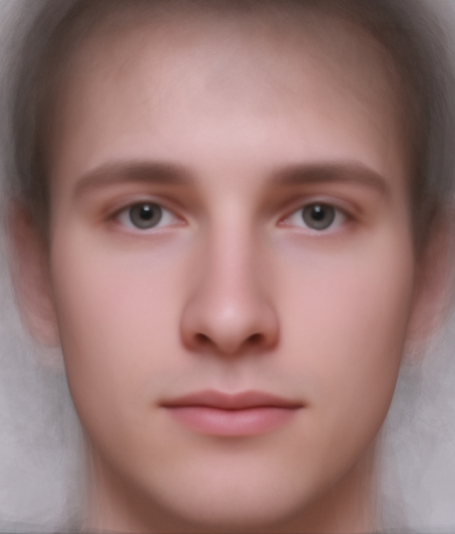
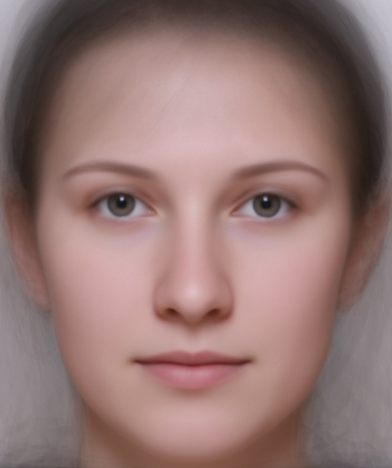

layout: true

```{r setup, include = FALSE}
library("knitr")
library("rmarkdown")

options(htmltools.dir.version = FALSE)

opts_chunk$set(echo = FALSE, fig.align = "center")
```

<div class="my-footer">
  <div style="float: left;"><span>`r gsub("<br />", " & ", gsub("<br /><br />|<a.+$", "", metadata$author))`</span></div>
  <div style="float: right;"><span>`r metadata$location`, `r metadata$date`</span></div>
  <div style="text-align: center;"><span>`r gsub(".+<br />", " ", metadata$title)`: `r gsub(".+<br />", " ", metadata$subtitle)`</span></div>
</div>

<script type="text/x-mathjax-config">
MathJax.Hub.Config({
  "HTML-CSS": {
    scale: 150,
  }
});
</script>

---
# About us

Frederik Aust ([frederik.aust@uni-koeln.de](mailto:frederik.aust@uni-koeln.de), [@frederikaust](http://twitter.com/frederikaust))

- PhD student at the University of Cologne<br />(Prof. Dr. Christoph Stahl)
- Founding memeber of [Cologne Open Science<br />working group](https://www.hf.uni-koeln.de/39711)
- Author and contributor to several R packages<br> (e.g., [`afex`](https://cran.r-project.org/web/packages/afex/index.html), [`citr`](https://cran.r-project.org/web/packages/citr/index.html), [`papaja`](https://github.com/crsh/papaja), [`prereg`](https://cran.r-project.org/web/packages/prereg/index.html))


---
# About us

Johannes Breuer ([johannes.breuer@gesis.org](mailto:johannes.breuer@gesis.org), [@MattEagle09](https://twitter.com/MattEagle09))

- PhD in psychology, University of Cologne (media psychology, Prof. Dr. Gary Bente)
- senior researcher at GESIS &ndash; Leibniz Institute for the Social Sciences (Data Archive for the Social Sciences)


---
# Preliminaries

- Feel free to ask questions at any point
- Learn by doing

Slides and material are available at

.center[`...`]


---
# Workshop outline

...

???
- Questions?


---
class: inverse, middle, center

# `r metadata$title`

 
---
class: middle

# `r gsub(".+<br />", " ", metadata$title)`

> .highlight[do not let the perfect be the enemy of the good].
Share and document what you can, as it will provide a benefit compared with not sharing (p. 4, Klein et al., 2018).


---
class: middle

# `r gsub(".+<br />", " ", metadata$title)`

> being an open scientist means .highlight[adopting a few straightforward research management practices, which lead to less error-prone, reproducible research workflows] with each incremental step adding positive value<br />(p. 11, Klein et al., 2018).


---
class: inverse, middle, center

# Why to share


---
# Why to share

<!-- TODO: Copy-paste from Candice Morey -->

- It's just documenting your work, making it easier to understand
    - So that lab members can learn from each other
    - So that you don't forget what you've done
    - So that your colleagues can help your work flourish
- Has the bonus of allowing you to share outside, if/when you want


---
# Example project

### Research question

Can we accurately judge a person's IQ by looking at their face?

### Material

Photographs of students with known IQ scores

```{r example-elements}
example_citation <- '<div class="reference">Kleisner, K., Chvátalová, V., & Flegr, J. (2014). Perceived Intelligence Is Associated with Measured Intelligence in Men but Not Women. <i>PLoS ONE</i>, 9(3): e81237. doi: <a href="https://doi.org/10.1371/journal.pone.0081237">10.1371/journal.pone.0081237</a></div>'

example_likert_scale <- '<table id="likert">
   <tr>
       <td><input id="radGuiltyStart" type="radio" name="Guilty" value="7" /></td>
       <td><input type="radio" name="Guilty" value="6" /></td>
       <td><input type="radio" name="Guilty" value="5" /></td>
       <td><input type="radio" name="Guilty" value="4" /></td>
       <td><input type="radio" name="Guilty" value="3" /></td>
       <td><input type="radio" name="Guilty" value="2" /></td>
       <td><input id="radGuiltyEnd" type="radio" name="Guilty" value="1" /></td>
   </tr>
   <tr>
       <td><small>Low</small></td>
       <td></td>
       <td></td>
       <td><small>Intelligence</small></td>
       <td></td>
       <td></td>
       <td><small>High</small></td>
   </tr>
</table>'
```


`r example_citation`

???
~50,000 students, 17 faculties = 3000 students per faculty


---
# Example project

.center[]

`r example_likert_scale`

`r example_citation`


---
# Example project

.center[]

`r example_likert_scale`

`r example_citation`


---
# Example project

.center[]

`r example_likert_scale`

`r example_citation`


---
# Example project

.center[]

`r example_likert_scale`

`r example_citation`


---
.pull-left[]

# Study protocol

```{r registered-reports-graphic}
include_graphics("images/registered-reports.png")
```


---
.pull-left[]

# Materials


---
.pull-left[]

# Data


---
.pull-left[]

# Analyses


---
class: inverse, middle

> Open Science is just science done right<br /><br />&mdash;Jon Tennant, Imperial College London


---
# Acknowledgments

- Workshop material is based on<br />Klein, O., Hardwicke, T. E., Aust, F., Breuer, J., Danielsson, H., Mohr, A. H., … Frank, M. C. (2018). A Practical Guide for Transparency in Psychological Science. Collabra: Psychology, 4(1). doi: [10.1525/collabra.158](https://doi.org/10.1525/collabra.158)  ([](https://creativecommons.org/licenses/by/4.0/))
- Slides created in R with [`xaringan`](https://github.com/yihui/xaringan)
- Icons by [Icons8](https://icons8.com) ([](https://creativecommons.org/licenses/by-nd/3.0/))


